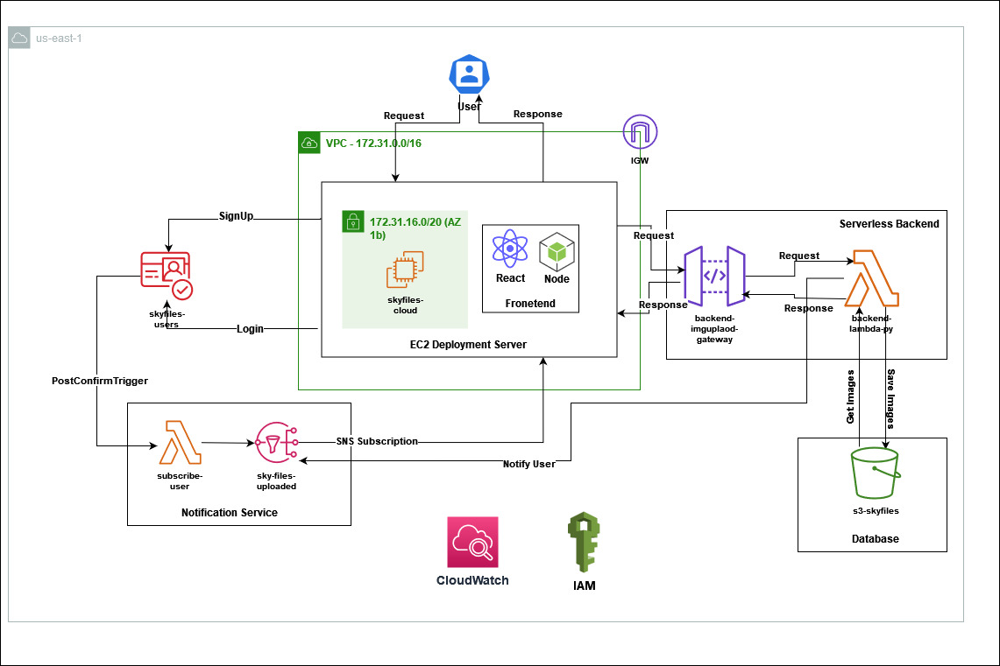

# Skyfiles

The Skyfiles Photo Cloud application consists of a React web application hosted on an AWS EC2 instance. This frontend application allows users to upload and view their photos, which are stored in an AWS S3 bucket. The application uses AWS Lambda functions for serverless processing of image uploads and other tasks, such as generating email notifications or sharing photos.

AWS API Gateway is utilized to create secure and efficient API endpoints for the React application to communicate with the Lambda functions and S3 storage. AWS Cognito is integrated for user authentication and access control, ensuring that only authorized users can upload and view their photos. Additionally, the application leverages AWS SNS to send notifications to users when specific events occur, such as successful image uploads or when new photos are available for viewing.
Key Features:
1. User authentication and authorization with AWS Cognito
2. Image upload and storage in AWS S3
3. Serverless backend processing with AWS Lambda
4. Secure API endpoints using AWS API Gateway
5. Notifications using AWS SNS

## Cloud Architecture

The architecture of the web application includes a distributed architecture in frontend, serverless backend and database. The frontend is built using a React web application which is hosted on an AWS EC2 instance. The API Gateway handles the API calls made from the frontend to serve the user. The API Gateway together with Lambda function creates the serverless backend for this application. The application uses S3 bucket to store images and SNS service to send notifications to the user.

